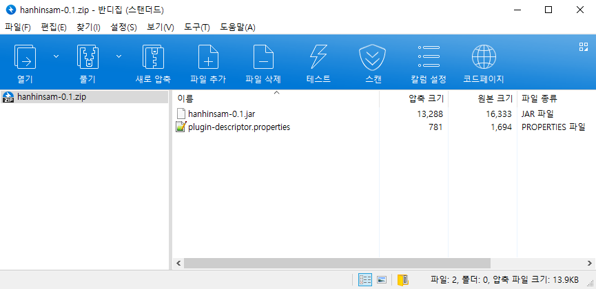
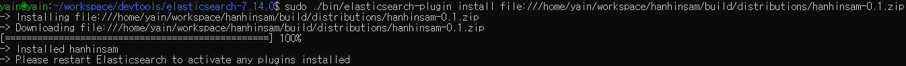

## 1. 소개

엘라스틱서치(ElasticSearch)에서 한글 검색 확장 기능을 위해 만든 토큰 필터 플러그인입니다.

이 프로젝트는 elasticsearch 8.1.2으로 작성되었습니다. 버전 차이가 크지 않다면 큰 상관이 없을 수 있지만 혹시 버전 차이로 빌드나 동작에 문제가 발생한다면 `build.gradle`에서 elasticsearch와 org.elasticsearch.gradle:build-tools 버전을 수정해야 합니다. 버전 수정 후 라이브러리 버전 차이에 따른 문제가 발생하면 해당 부분의 코드를 수정 후 빌드하여 사용해야 합니다.

※ elasticsearch 8버전 플러그인은 java 11, 13 모두 실패하여 openjdk17을 사용해서 빌드했습니다. 혹시 빌드가 실패한다면 java와 gradle 버전을 업데이트 해주세요

<br>

해당 `Readme.md` 후반부의 예제는 설명을 위해 매우 간단한 case들에 적용하였으며 실제 검색에 적용하기 위해서는 더 복잡한 필드 매핑 설계 및 커스텀 분석기 디자인이 필요합니다.
아래 링크는 이 플러그인을 적용하여 만든 도서 검색 API 프로젝트 github repository 입니다.
[https://github.com/yaincoding/yacobooks-api](https://github.com/yaincoding/yacobooks-api)

<br>

지원하는 토큰 필터 종류는 아래와 같습니다.

**1) 자모 분리 필터(hanhinsam_jamo)**

한글 토큰 문자열을 자음/모음 단위로 분리해줍니다. 한글은 유니코드 특성상 초성/중성/종성이 결합된 형태여서 엘라스틱서치 Term Suggest API를 그대로 사용하기에는 무리가 있습니다. 따라서 자모단위로 분리된 필드를 추가적으로 색인하고 해당 필드를 통해 오타교정을 진행합니다.

ex) 엘라스틱서치 → ㅇㅔㄹㄹㅏㅅㅡㅌㅣㄱㅅㅓㅊㅣ

**2) 초성 필터(hanhinsam_chosung)**

한글 토큰 문자열의 초성을 추출합니다. 초성 검색에 사용됩니다.

ex) 엘라스틱서치 → ㅇㄹㅅㅌㅅㅊ

**3) 한 → 영 변환 필터(hanhinsam_hantoeng)**

한글 토큰 문자열을 자모 단위로 분해한 후 키보드 배열의 매칭되는 영어 문자열로 변환합니다. 

ex) 딤ㄴ샻ㄴㄷㅁㄱ초 → elasticsearch

**4) 영 → 한 변환 필터(hanhinsam_engtohan)**

영어 토큰 문자열을 키보드 배열에 매칭되는 한글 문자열로 변환합니다.

ex) dpffktmxlrtjcl → 엘라스틱서치 

<br>

## 2. 빌드 및 설치

#### 2-1. 빌드

프로젝트 clone 후 루트 디렉터리에서 gradle 빌드 실행

``` shell
./gradlew clean assemble
```

<br>

#### 2-2. 플러그인 zip 압축파일 생성 확인

build/distributions/hanhinsam-0.1.zip



1. jar 라이브러리
2. plugin-descriptor.properties

<br>

#### 2-3. 엘라스틱서치에 플러그인 설치

sudo 권한으로 elasticsearch/bin/plugin-install을 실행하여 플러그인을 설치합니다.

``` shell
sudo bin/elasticsearch-plugin install file://<path_to_hanhinsam_zip>
```



<br>

docker-elk 등 컨테이너에서 엘라스틱서치를 실행하는 경우 Dockerfile에서 이미지 빌드시에 플러그인을 설치하도록 작성합니다.

``` yml
...

COPY plugins/hanhinsam-0.1.zip /plugins/hanhinsam.zip
RUN elasticsearch-plugin install file:///plugins/hanhinsam.zip 
```

#### 2-4. 엘라스틱서치 재시작

엘라스틱서치를 실행중이었다면 재시작해야 플러그인이 적용됩니다. 

<br>

## 3. 예제

**1) 오타 교정**

특정 필드 검색시 오타교정을 할 계획이라면 자모 분리한 문자열을 색인하기 위한 필드를 추가적으로 생성합니다. 해당 필드는 분석이 필요하므로 `text` 타입입니다. 이 필드를 분석하기 위한 분석기를 만들고 필터에 `jamo_filter`를 적용합니다. Term Suggest API 를 사용하면 해당 필드를 통해 오타 교정이 가능합니다.

``` javascript
//인덱스 생성
PUT /spell_test
{
  "settings": {
    "number_of_shards": 1,
    "number_of_replicas": 0,
    "index.max_ngram_diff": 10,
    "analysis": {
      "analyzer": {
        "jamo_analyzer": {
          "type": "custom",
          "tokenizer": "standard",
          "filter": [
            "lowercase",
            "hanhinsam_jamo"
          ]
        }
      }
    }
  },
  "mappings": {
    "properties": {
      "name": {
        "type": "keyword",
        "copy_to": ["name_jamo"]
      },
      "name_jamo": {
        "type": "text",
        "analyzer": "jamo_analyzer"
      }
    }
  }
}

//데이터 색인
POST /_bulk
{ "index" : { "_index" : "spell_test", "_id" : "1" } }
{ "name" : "손오공" }
{ "index" : { "_index" : "spell_test", "_id" : "2" } }
{ "name" : "엘라스틱서치" }
{ "index" : { "_index" : "spell_test", "_id" : "3" } }
{ "name" : "아메리카노" }

//오타교정 검색 테스트
POST /spell_test/_search
{
  "suggest": {
    "name_suggest": {
      "text": "아메리치노",
      "term": {
        "field": "name_jamo",
        "max_edits": 2
      }
    }
  }
}
```

``` javascript
//응답결과
{
  "took" : 7,
  "timed_out" : false,
  "_shards" : {
    "total" : 1,
    "successful" : 1,
    "skipped" : 0,
    "failed" : 0
  },
  "hits" : {
    "total" : {
      "value" : 0,
      "relation" : "eq"
    },
    "max_score" : null,
    "hits" : [ ]
  },
  "suggest" : {
    "name_suggest" : [
      {
        "text" : "ㅇㅏㅁㅔㄹㅣㅊㅣㄴㅗ",
        "offset" : 0,
        "length" : 5,
        "options" : [
          {
            "text" : "ㅇㅏㅁㅔㄹㅣㅋㅏㄴㅗ",
            "score" : 0.8,
            "freq" : 1
          }
        ]
      }
    ]
  }
}
```

**2) 한/영 변환 오타 교정**

한/영 변환한 문자열을 색인하기 위한 필드를 각각 추가적으로 생성합니다. 해당 필드는 분석이 필요하기때문에 `text` 타입입니다. 한/영 변환 필터가 적용된 분석기를 만들고 각 분석기를 한/영 변환 필드의 `search_analyzer`로 지정합니다.

``` javascript
//인덱스 생성
PUT /haneng_test
{
  "settings": {
    "number_of_shards": 1,
    "number_of_replicas": 0,
    "index.max_ngram_diff": 10,
    "analysis": {
      "analyzer": {
        "engtohan_analyzer": {
          "type": "custom",
          "tokenizer": "standard",
          "filter": [
            "lowercase",
            "hanhinsam_engtohan"
          ]
        },
        "hantoeng_analyzer": {
          "type": "custom",
          "tokenizer": "standard",
          "filter": [
            "lowercase",
            "hanhinsam_hantoeng"
          ]
        }
      }
    }
  },
  "mappings": {
    "properties": {
      "name": {
        "type": "keyword",
        "copy_to": ["name_hantoeng", "name_engtohan"]
      },
      "name_hantoeng": {
        "type": "text",
        "search_analyzer": "hantoeng_analyzer"
      },
      "name_engtohan": {
        "type": "text",
        "search_analyzer": "engtohan_analyzer"
      }
    }
  }
}

//데이터 색인
POST /_bulk
{ "index" : { "_index" : "haneng_test", "_id" : "1" } }
{ "name" : "손오공" }
{ "index" : { "_index" : "haneng_test", "_id" : "2" } }
{ "name" : "elastic" }
{ "index" : { "_index" : "haneng_test", "_id" : "3" } }
{ "name" : "아메리카노" }

//한영 변환 오타교정 검색 테스트
POST /haneng_test/_search
{
  "query": {
    "match": {
      "name_hantoeng": "딤ㄴ샻"
    }
  }
}

//영한 변환 오타교정 검색 테스트
POST /haneng_test/_search
{
  "query": {
    "match": {
      "name_engtohan": "thsdhrhd"
    }
  }
}
```

``` javascript
//영한 변환 오타교정 검색 테스트 응답결과
{
  "took" : 2,
  "timed_out" : false,
  "_shards" : {
    "total" : 1,
    "successful" : 1,
    "skipped" : 0,
    "failed" : 0
  },
  "hits" : {
    "total" : {
      "value" : 1,
      "relation" : "eq"
    },
    "max_score" : 0.9808291,
    "hits" : [
      {
        "_index" : "haneng_test",
        "_type" : "_doc",
        "_id" : "2",
        "_score" : 0.9808291,
        "_source" : {
          "name" : "elastic"
        }
      }
    ]
  }
}

//한영 변환 오타교정 검색 테스트 응답결과
{
  "took" : 2,
  "timed_out" : false,
  "_shards" : {
    "total" : 1,
    "successful" : 1,
    "skipped" : 0,
    "failed" : 0
  },
  "hits" : {
    "total" : {
      "value" : 1,
      "relation" : "eq"
    },
    "max_score" : 0.9808291,
    "hits" : [
      {
        "_index" : "haneng_test",
        "_type" : "_doc",
        "_id" : "1",
        "_score" : 0.9808291,
        "_source" : {
          "name" : "손오공"
        }
      }
    ]
  }
}
```

**3) 초성 검색**

초성이 분리된 문자열을 색인하기 위한 `text` 타입의 필드를 추가적으로 생성하고 초성 필터가 적용된 분석기를 만듭니다. 이후 해당 필드를 통해 초성 검색이 가능합니다.

``` javascript
//인덱스 생성
PUT /chosung_test
{
  "settings": {
    "number_of_shards": 1,
    "number_of_replicas": 0,
    "index.max_ngram_diff": 10,
    "analysis": {
      "analyzer": {
        "chosung_analyzer": {
          "type": "custom",
          "tokenizer": "standard",
          "filter": [
            "lowercase",
            "hanhinsam_chosung"
          ]
        }
      }
    }
  },
  "mappings": {
    "properties": {
      "name": {
        "type": "keyword",
        "copy_to": ["name_chosung"]
      },
      "name_chosung": {
        "type": "text",
        "analyzer": "chosung_analyzer"
      }
    }
  }
}

//데이터 색인
POST /_bulk
{ "index" : { "_index" : "chosung_test", "_id" : "2" } }
{ "name" : "엘라스틱서치" }
{ "index" : { "_index" : "chosung_test", "_id" : "3" } }
{ "name" : "아메리카노" }

//초성검색 테스트
POST /chosung_test/_search
{
  "query": {
    "match": {
      "name_chosung": "ㅇㄹㅅㅌㅅㅊ"
    }
  }
}
```

``` javascript
//응답결과
{
  "took" : 1,
  "timed_out" : false,
  "_shards" : {
    "total" : 1,
    "successful" : 1,
    "skipped" : 0,
    "failed" : 0
  },
  "hits" : {
    "total" : {
      "value" : 1,
      "relation" : "eq"
    },
    "max_score" : 0.6931471,
    "hits" : [
      {
        "_index" : "chosung_test",
        "_type" : "_doc",
        "_id" : "2",
        "_score" : 0.6931471,
        "_source" : {
          "name" : "엘라스틱서치"
        }
      }
    ]
  }
}
```

**4) 자동완성**

자동완성을 위한 `text`타입의 필드를 추가적으로 생성합니다. 색인 분석기는 ngram 토크나이저를 통해 부분 문자열이 같이 색인되도록 합니다. 검색 분석기에는 `jamo_filter`만 적용합니다. 이후 분석을 위해 추가 생성한 필드를 통해 부분일치를 통한 검색이 가능하며 이 기능을 통해 서비스에서는 자동완성 기능을 구현할 수 있게됩니다.

``` javascript
//인덱스 생성
PUT /ac_test
{
  "settings": {
    "number_of_shards": 1,
    "number_of_replicas": 0,
    "index.max_ngram_diff": 30,
    "analysis": {
      "filter": {
        "ngram_filter": {
          "type": "ngram",
          "min_gram": 1,
          "max_gram": 20
        }
      },
      "analyzer": {
        "jamo_analyzer": {
          "type": "custom",
          "tokenizer": "standard",
          "filter": [
            "lowercase",
            "hanhinsam_jamo"
          ]
        },
        "ngram_jamo_analyzer": {
          "type": "custom",
          "tokenizer": "standard",
          "filter": [
            "lowercase",
            "hanhinsam_jamo",
            "ngram_filter"
          ]
        }
      }
    }
  },
  "mappings": {
    "properties": {
      "name": {
        "type": "keyword",
        "copy_to": "name_ngram"
      },
      "name_ngram": {
        "type": "text",
        "analyzer": "ngram_jamo_analyzer",
        "search_analyzer": "jamo_analyzer"
      }
    }
  }
}

//데이터 색인
POST /_bulk
{ "index" : { "_index" : "ac_test", "_id" : "1" } }
{ "name" : "손오공" }
{ "index" : { "_index" : "ac_test", "_id" : "2" } }
{ "name" : "elastic" }
{ "index" : { "_index" : "ac_test", "_id" : "3" } }
{ "name" : "아메리카노" }

//자동완성 검색 테스트
POST /ac_test/_search
{
  "query": {
    "match": {
      "name_ngram": "아멜"
    }
  }
}
```

``` javascript
//응답결과
{
  "took" : 1,
  "timed_out" : false,
  "_shards" : {
    "total" : 1,
    "successful" : 1,
    "skipped" : 0,
    "failed" : 0
  },
  "hits" : {
    "total" : {
      "value" : 1,
      "relation" : "eq"
    },
    "max_score" : 1.631392,
    "hits" : [
      {
        "_index" : "ac_test",
        "_type" : "_doc",
        "_id" : "3",
        "_score" : 1.631392,
        "_source" : {
          "name" : "아메리카노"
        }
      }
    ]
  }
}
```